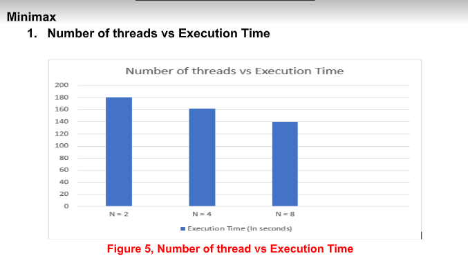
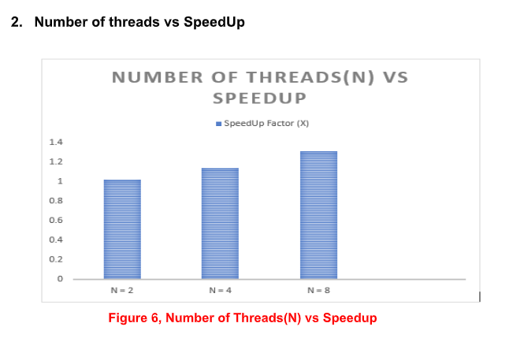

# C++_Tic-Tac-Toe

<h1>Tic-Tac-Toe Game implemented using MinMax Algorith.</h1>

Minimax algorithm uses the fact that the two players are working towards opposite goals to make
predictions about which future states will be reached as the game progresses, and then proceeds
accordingly to optimize its chance of victory. The theory behind minimax is that the algorithm&#39;s opponent
will be trying to minimize whatever value the algorithm is trying to maximize (hence, &quot;minimax&quot;). Thus, the
computer should make the move which leaves its opponent capable of doing the least damage.

It was found that running 4 by 4 tic-tac-toe board game parallely using multiple threads
had a good effect on speed-up. However, it seems that greater speedup can be achieved with bigger
problem size but it is very hard to test the same with the available architecture.

For implementation of Parallelized version of Minimax algorithm, we took the serialized version of
minimax algorithm based on the following Pseudo-code taken from Wikipedia.

Used Parallel Platform: POSIX pthreads
Architecture: x86_64
Processing Unit: CPU

An exhaustive use of the minimax algorithm tends to be hopelessly impractical--and, for many win-or-lose
games, uninteresting. A computer can compute all possible outcomes for a relatively simple game like tic-
tac-toe (disregarding symmetric game states, there are 9! = 362,880 possible outcomes; the X player has
a choice of 9 spaces, then the O has a choice of 8, etc.), but it won&#39;t help. As veteran tic-tac-toe players
know, there is no opening move which guarantees victory; so, a computer running a minimax algorithm
without any sort of enhancements will discover that, if both it and its opponent play optimally, the game
will end in a draw no matter where it starts, and thus have no clue as to which opening play is the &quot;best.&quot;
Even in more interesting win-or-lose games like chess, even if a computer could play out every possible
game situation (a hopelessly impossible task), this information alone would still lead it to the conclusion
that the best it can ever do is draw (which would in fact be true, if both players had absolutely perfect
knowledge of all possible results of each move). It is only for games where an intelligent player is
guaranteed victory by going first or second (such as Nim, in many forms) that minimax will prove sufficient
However, minimax is still useful when employed with heuristics which approximate possible
outcomes from a certain point. For a game like chess, for instance, pieces are often assigned values to
approximate their relative strengths and usefulness for winning the game (queen = 9, rook = 5, etc.). So,
while a computer may not be able to envision all possible situations down to checkmate from the first
move, it may be able to tell which move is more likely to lead to a material advantage.
Games with random elements (such as backgammon) also make life difficult for minimax algorithms. In
these cases, an &quot;expectimax&quot; approach is taken. Using the probabilities of certain moves being available
to each player (the odds of dice combinations, for example) in addition to their conflicting goals, a
computer can compute an &quot;expected value&quot; for each node it can reach from the current game state. As
actual game events take place, the possibilities must be frequently refreshed; yet, this approach still
allows for intelligent moves to be made
In our parallelized version, we have divided the work of computing expectimax for our tic-tac-toe among
multiple threads. We divide the snapshot of the current state of the board between all the threads for
them to share as an input and use that snapshot to compute the heuristics for the next moves. Once all
the threads are done computing, they join and the player takes their next turn and once again threads
turn in to compute the next moves and so on.
In between the moves, after each move the threads are synchronized and we check for the winning state
if any player has won. If not, the process continues, otherwise the program halts.

<h2> Analysis of the algo </h2>

